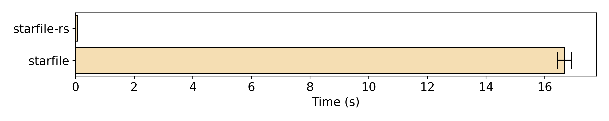
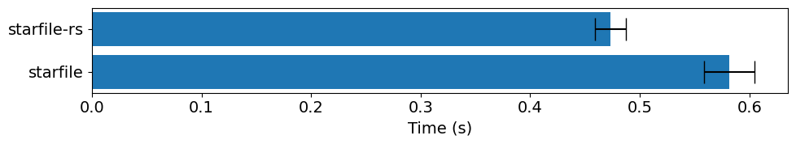

# :star: starfile-rs :crab:

A blazing-fast and type-safe STAR file reader (and writer - to be implemented) powered by Rust.

```python
from starfile_rs import read_star

read_star("path/to/file.star")  # read as a dict-like object of data blocks
```

## Installation

```bash
pip install starfile-rs[pandas]  # for pandas support
pip install starfile-rs[polars]  # for polars support
```

or clone this repository and install locally (requires Rust):

```bash
git clone https://github.com/hanjinliu/starfile-rs.git
cd starfile-rs
pip install -e .[pandas]  # for pandas support
pip install -e .[polars]  # for polars support
```

## Highlights

### Performance

All the data are from [Burt et al.](https://zenodo.org/records/11068319)

- **Example 1**: Random access to a data block located at an unknown position in a 15 MB STAR file (`Polish/job050/motion.star`)

  

  `starfile-rs` does not parse string to `pandas.DataFrame` until you call `.to_pandas()`, so it is extremely fast for random access in a large STAR file.

- **Example 2**: Parsing a 12 MB data block (The "particles" block from `"Refine3D/bin6/run_it000_data.star"`).

  

  Reading lines and whitespace trimming are performed in Rust. This speeds up the parsing significantly even though the table parsing is similarly done by `pandas`. If you use `polars.DataFrame`, the performance gain is more significant.

### Type Safety

One cannot determine the structure of a STAR file until actually parsing it.`starfile-rs` splits the safe (`try_*`) and unsafe (`trust_*`) methods to avoid extensive isinstance checks.

```python
from starfile_rs import read_star

path = "path/to/file.star"

star = read_star(path)  # Safe, unless the file is broken
star["general"]  # Unsafe, if the block does not exist

if block := star.get("general"):  # Safe
    block.to_pandas()
    block.to_polars()

if block := star.get("general"):
    block.trust_single()  # Unsafe, if the block is not a single data block

if block := star.get("general"):
    if single := block.try_single():  # Safe
        single.to_dict()
```
